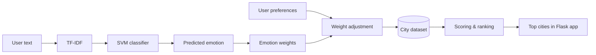

<div align="center">

# ✈️ Travel Recommender

**An emotion-aware travel recommendation system powered by Machine Learning**


[Features](#-features) • [Architecture](#-architecture) • [Getting Started](#-getting-started) • [Roadmap](#-roadmap)

</div>

---

## 📖 About

**Travel Recommender** suggests destinations based on the user's **emotional state** and **travel preferences**. The user writes a short free text; the system detects the underlying emotion, combines it with preferences (beaches, green spaces, history, museums, romance, city size), and ranks cities by a personalized score.

The dataset covers cities in **Morocco, Spain and Portugal**, the three countries hosting the **2030 FIFA World Cup**. The engine is exposed through an interactive **Flask** web application.

---

## ✨ Features

| | Module | Description |
|---|---|---|
| 🧠 | **Emotion detection** | TF-IDF + SVM classifier predicting sad, happy, love, anger, fear or curious |
| 🎯 | **Emotion-based weighting** | Each emotion maps to different destination weights |
| 🎛️ | **User preferences** | Weights are adjusted according to the user's own preferences |
| 📊 | **Destination scoring** | Cities ranked by a weighted score over their attributes |
| 🏛️ | **Destination details** | Country, history, green spaces, beaches and museums |
| 🌐 | **Web interface** | Flask app with expression, preferences and results pages |

---

## 🧱 Architecture



### Recommendation logic

The detected emotion shifts the weights of each attribute, for instance:

| Emotion | Favored destinations |
|---|---|
| 😔 Sad | Green spaces, smaller and calmer cities |
| 😊 Happy | Beaches, active, medium or large cities |
| ❤️ Love | Romantic, historical places, museums |

User preferences then adjust these weights (`emotion weight × preference`), so two users with the same emotion can receive different results. Each city is scored as:

```text
Score = Σ (attribute value × adjusted weight)
        over: beach, green space, historical, museum, population type, romantic
```

<details>
<summary><b>📂 Project structure</b></summary>

```text
├── app.py                          # Flask application
├── requirements.txt
├── SchemaProjetML.drawio.png       # ML pipeline diagram
├── data/villes_finales.csv         # City dataset
├── model/
│   ├── emotion_detection_model.pkl # Trained SVM
│   └── tfidf.pkl                   # Trained vectorizer
└── templates/                      # index, express, result (Jinja2)
```

</details>

---

## 🚀 Getting Started

**Prerequisites:** Python 3.x, pip

```bash
# Clone
git clone https://github.com/hanaekhayyi/travel-recommender.git
cd travel-recommender

# Virtual environment (Windows: venv\Scripts\activate)
python -m venv venv
source venv/bin/activate

# Install and run
pip install -r requirements.txt
python app.py
```

Then open **http://127.0.0.1:5000**.

---

## 🧭 Roadmap

**Modeling**
- [ ] Add training code or notebook and evaluation metrics
- [ ] Display confidence scores for detected emotions
- [ ] Refactor recommendation logic into a dedicated module

**Product**
- [ ] City images, interactive maps and destination descriptions
- [ ] Budget, trip-duration and weather-based filtering
- [ ] Hotel and transportation suggestions

**Engineering**
- [ ] Add `scikit-learn` explicitly to `requirements.txt`
- [ ] Automated tests, mobile responsiveness and online deployment

---

<div align="center">

### 👩‍💻 Author

**Hanae KHAYYI** · Data & AI Engineering Student

[](https://github.com/hanaekhayyi)

⭐ *If you found this project useful, feel free to star the repository.*

</div>
